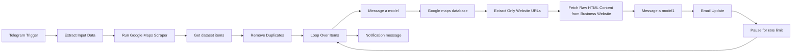
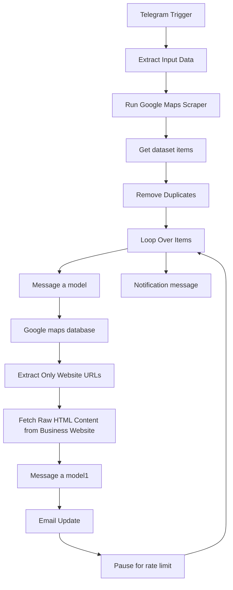

# Email and Phone Number Automated Scraper (n8n Workflow)

## Overview
This project contains a production-oriented n8n workflow that automates local lead generation from Google Maps, enriches each lead with an AI-generated company summary, extracts a primary business email from the company website, stores results in Google Sheets, and sends Telegram completion notifications.

Business problem solved:
- Manual lead research is slow, repetitive, and inconsistent.
- This workflow turns a simple Telegram command into a repeatable lead pipeline for sales, recruitment, and business development teams.

## Features
- Google Maps Lead Discovery
- Company Information Collection
- Website Extraction
- Website Scraping
- AI-Powered Company Summary Generation
- Email Extraction
- Lead Enrichment
- Google Sheets Integration
- Telegram Notifications

## Architecture
The workflow is event-driven and starts from Telegram. It executes in two enrichment phases:
1. Google Maps data retrieval + AI company summary generation
2. Website HTML scraping + AI email extraction

### High-Level Flow (Mermaid)


### Node-to-Node Dependency Graph (Mermaid)


## Project Structure
```text
n8n_scraping_agent/
├── Email , phoneNumber automated scraper.json
├── .env.example
├── README.md
└── screenshots/
    └── .gitkeep
```

Folder and file purpose:
- `Email , phoneNumber automated scraper.json`: Main n8n workflow export containing all nodes, expressions, and connections.
- `.env.example`: Environment variable template for local, non-Docker setup.
- `README.md`: Full technical and operational documentation.
- `screenshots/`: Placeholder directory for workflow canvas and run-result screenshots.

## Lead-Generation Process (End-to-End)
1. User sends a Telegram message with input values in semicolon-separated format: `sector;limit;mapsUrl`.
2. Workflow parses sector and lead limit.
3. Apify Google Maps actor searches businesses by sector.
4. Scraped dataset items are fetched and deduplicated by company title.
5. Each company is processed in a controlled loop.
6. Gemini generates a publish-ready company summary from Maps metadata.
7. Lead is appended to Google Sheets with company name, website, summary, and Maps URL.
8. Website URL is isolated and fetched as raw HTML.
9. Gemini extracts the best available business email from HTML.
10. Existing row is updated in Google Sheets with extracted email.
11. Workflow waits briefly for rate limiting and continues to next lead.
12. Completion notification is sent to Telegram.

## Workflow Breakdown

### 1) Telegram Trigger
- Node Name: `Telegram Trigger`
- Purpose: Starts the workflow on incoming Telegram messages.
- Input: Telegram update payload (`message`).
- Output: Chat message text and metadata.
- Dependencies: Telegram API credentials.

### 2) Extract Input Data
- Node Name: `Extract Input Data`
- Purpose: Parses message text into structured fields.
- Input: `message.text` expected as `sector;limit;mapsUrl`.
- Output: `sector`, `limit` (integer), `mapsUrl`.
- Dependencies: Upstream message format consistency.

### 3) Run Google Maps Scraper
- Node Name: `Run Google Maps Scraper`
- Purpose: Triggers Apify actor `Google Maps Scraper (compass/crawler-google-places)`.
- Input: Parsed sector and limit.
- Output: Dataset reference including `defaultDatasetId`.
- Dependencies: Apify OAuth2 credentials; actor availability.

### 4) Get dataset items
- Node Name: `Get dataset items`
- Purpose: Loads lead records from the Apify dataset.
- Input: `defaultDatasetId` from previous node.
- Output: Array of place/company objects.
- Dependencies: Apify dataset existence and API quota.

### 5) Remove Duplicates
- Node Name: `Remove Duplicates`
- Purpose: Deduplicates records by `title`.
- Input: Dataset items.
- Output: Unique records.
- Dependencies: Reliable `title` values.

### 6) Loop Over Items
- Node Name: `Loop Over Items`
- Purpose: Controls iterative per-lead processing and completion signaling.
- Input: Deduplicated lead list and loop-back signal.
- Output: Per-item processing branch and completion branch.
- Dependencies: Split in Batches behavior.

### 7) Message a model
- Node Name: `Message a model`
- Purpose: Generates company summary JSON using Gemini.
- Input: Google Maps fields (`title`, `categoryName`, `address`, `city`, `countryCode`, `phones`, `url`).
- Output: JSON containing `title`, `website`, `companySummary`, `mapsUrl`.
- Dependencies: Google Gemini API credentials and model response quality.

### 8) Google maps database
- Node Name: `Google maps database`
- Purpose: Appends initial lead data into Google Sheets.
- Input: AI output and mapped fields.
- Output: New spreadsheet rows.
- Dependencies: Google Sheets OAuth2 credentials; correct column mapping.

### 9) Extract Only Website URLs
- Node Name: `Extract Only Website URLs`
- Purpose: Normalizes website URL into `Site internet` field.
- Input: Current lead item from loop.
- Output: `Site internet` URL.
- Dependencies: Presence of `website` in source lead.

### 10) Fetch Raw HTML Content from Business Website
- Node Name: `Fetch Raw HTML Content from Business Website`
- Purpose: Fetches website HTML for email extraction.
- Input: `Site internet` URL.
- Output: Raw page payload (`data`).
- Dependencies: Reachable website, valid URL, HTTP success.

### 11) Message a model1
- Node Name: `Message a model1`
- Purpose: Extracts best business contact email from HTML content.
- Input: Website HTML (`data`).
- Output: Single email or `Null`.
- Dependencies: Google Gemini API credentials; parsable HTML text.

### 12) Email Update
- Node Name: `Email Update`
- Purpose: Upserts lead row in Google Sheets, matching by company name.
- Input: Extracted email and mapped lead fields.
- Output: Updated spreadsheet records.
- Dependencies: Matching key integrity (`companyName`), Sheets permissions.

### 13) Pause for rate limit
- Node Name: `Pause for rate limit`
- Purpose: Adds a short delay between iterations.
- Input: Post-update event.
- Output: Loop continuation signal.
- Dependencies: Loop timing requirements and provider rate limits.

### 14) Notification message
- Node Name: `Notification message`
- Purpose: Sends completion message (`DONE`) to Telegram chat.
- Input: Chat ID from trigger context.
- Output: Telegram message delivery status.
- Dependencies: Telegram API credentials and chat accessibility.

## Data Flow
1. Lead discovery: `Run Google Maps Scraper` queries Google Maps via Apify by sector.
2. Company data extraction: `Get dataset items` retrieves structured place details.
3. Website lookup: Website field from each place is passed through `Extract Only Website URLs`.
4. Website scraping: `Fetch Raw HTML Content from Business Website` downloads HTML.
5. AI processing: `Message a model` builds company summary text from Maps metadata.
6. Email extraction: `Message a model1` extracts the strongest contact email from HTML.
7. Data validation: `Remove Duplicates` prevents duplicate titles; upsert logic avoids duplicate row keys.
8. Google Sheets storage: `Google maps database` appends, `Email Update` upserts enriched records.
9. Telegram notification: `Notification message` confirms pipeline completion.

## Installation (Without Docker)

### Prerequisites
- Node.js 18+ and npm
- n8n installed locally
- Google account with Sheets access
- Telegram Bot token
- Google Gemini API key (or compatible Google AI credentials)
- Apify account and token/OAuth credentials

### Install and run n8n locally
```bash
npm install -g n8n
n8n
```

n8n will be available locally (commonly at `http://localhost:5678`).

### Import Workflow
1. Open n8n editor.
2. Click Import from file.
3. Select `Email , phoneNumber automated scraper.json`.
4. Create and attach credentials for all required services.
5. Activate workflow and execute a test run.

### Trigger Format
Send a Telegram message in this format:
```text
sector;limit;mapsUrl
```
Example:
```text
accounting firms paris;20;https://maps.google.com
```

Note: `mapsUrl` is currently parsed by `Extract Input Data` but not used by downstream nodes.

## Credentials Required
| Service | Purpose | Used By Node(s) |
|---|---|---|
| Apify OAuth2 API | Google Maps scraping and dataset reads | `Run Google Maps Scraper`, `Get dataset items` |
| Google Sheets OAuth2 | Store and update leads | `Google maps database`, `Email Update` |
| Telegram API | Triggering and completion notifications | `Telegram Trigger`, `Notification message` |
| Google Gemini (PaLM) API | AI summary and email extraction | `Message a model`, `Message a model1` |

## Environment Variables
Create a local `.env` file from `.env.example` and populate credentials:

```env
# n8n runtime
N8N_HOST=localhost
N8N_PORT=5678
N8N_PROTOCOL=http
N8N_EDITOR_BASE_URL=http://localhost:5678
WEBHOOK_URL=http://localhost:5678
N8N_ENCRYPTION_KEY=replace_with_a_long_random_value

# Apify
APIFY_TOKEN=replace_with_apify_token

# Google Gemini / Google AI
GEMINI_API_KEY=replace_with_gemini_key

# Telegram
TELEGRAM_BOT_TOKEN=replace_with_telegram_bot_token

# Google Sheets (OAuth app/client used by n8n credential setup)
GOOGLE_CLIENT_ID=replace_with_google_client_id
GOOGLE_CLIENT_SECRET=replace_with_google_client_secret
GOOGLE_REFRESH_TOKEN=replace_with_google_refresh_token
GOOGLE_SHEET_ID=1yA7peKjky01cBUuKkgcKoG1BpB5tyUIUzjVn_YoNoZM
GOOGLE_SHEET_NAME=Sheet1
```

Important:
- n8n credentials are typically configured through the UI and stored securely by n8n.
- Environment variables above are a deployment aid and reference template.

## Screenshots
Add screenshots to the `screenshots/` folder and update these links:

```md


```

## Project Architecture (Recruiter + Developer View)
### Recruiter View
- Demonstrates practical automation architecture using low-code orchestration.
- Integrates multiple SaaS systems (Apify, Google Sheets, Telegram, Gemini).
- Shows AI-assisted enrichment pipeline for real business outcomes.
- Includes operational concerns: deduplication, rate limiting, iterative processing, and notifications.

### Developer View
- Event-driven ingestion with Telegram webhook trigger.
- Deterministic transformation layer via custom JavaScript parser (`Extract Input Data`).
- Two-stage enrichment model:
  - Stage 1: Metadata summarization from Google Maps payload.
  - Stage 2: Unstructured HTML analysis for contact extraction.
- Data persistence strategy:
  - Initial append for baseline lead storage.
  - Upsert on company name for enrichment updates.
- Reliability controls:
  - Deduplication (`Remove Duplicates`).
  - Loop throttling (`Pause for rate limit`).
  - Completion signaling (`Notification message`).

## Troubleshooting
- Undefined fields:
  - Verify Telegram input format is exactly `sector;limit;mapsUrl`.
  - Confirm Apify dataset fields exist (`title`, `website`, `url`, etc.).
- Empty AI outputs:
  - Check Gemini credentials and quota.
  - Inspect prompt output in node execution logs.
- Google Sheets mapping errors:
  - Ensure Sheet columns match configured mapping names.
  - Validate OAuth credentials and sheet sharing permissions.
- JSON parsing errors:
  - Confirm `Message a model` returns valid JSON only.
  - Add stricter response validation if needed.
- Telegram delivery issues:
  - Verify bot token and target chat ID permissions.
  - Ensure trigger and sender use correct Telegram credentials.
- Missing credentials:
  - Re-open each node and attach valid credentials.
  - Re-test each integration node independently.

## Future Improvements
- LinkedIn enrichment for decision-maker data.
- CRM integrations (HubSpot, Salesforce, Pipedrive).
- Automated outreach sequencing.
- Lead scoring based on relevance and confidence.
- Dashboard reporting for pipeline metrics.

## License
Add a license file appropriate for your organization before publishing.
